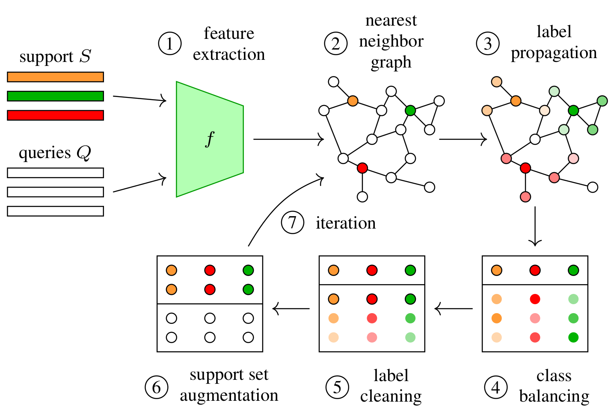

# iLPC

This repo covers the implementation of the following paper: 

**"Iterative label cleaning for transductive and semi-supervised few-shot learning (ICCV 2021)"** [Pre-print](https://arxiv.org/abs/2012.07962), [Paper](https://openaccess.thecvf.com/content/ICCV2021/html/Lazarou_Iterative_Label_Cleaning_for_Transductive_and_Semi-Supervised_Few-Shot_Learning_ICCV_2021_paper.html)
<p align='center'>
  
</p>

## Abstract

Few-shot learning amounts to learning representations and acquiring knowledge such that novel tasks may be solvedwith both supervision and data being limited.   Improved performance is possible by transductive inference, where theentire test set is available concurrently, and semi-supervisedlearning, where more unlabeled data is available.  Theseproblems are closely related because there is little or noadaptation of the representation in novel tasks.Focusing on these two settings, we introduce a new al-gorithm  that  leverages  the  manifold  structure  of  the  la-beled  and  unlabeled  data  distribution  to  predict  pseudo-labels,  while  balancing  over  classes  and  using  the  lossvalue distribution of a limited-capacity classifier to selectthe cleanest labels, iterately improving the quality of pseudo-labels. Our solution sets new state of the art results on fourbenchmark datasets, namelyminiImageNet,tieredImageNet,CUB and CIFAR-FS, while being robust over feature spacepre-processing  and  the  quantity  of  available  data.


If you find this repo useful for your research, please consider citing the paper
```
@inproceedings{lazarou2021iterative,
  title={Iterative label cleaning for transductive and semi-supervised few-shot learning},
  author={Lazarou, Michalis and Stathaki, Tania and Avrithis, Yannis},
  booktitle={Proceedings of the IEEE/CVF International Conference on Computer Vision},
  pages={8751--8760},
  year={2021}
}
```
## Datasets
For all of our experiments regarding WRN-28-10 backbone, we used the pre-trained features provided by [S2M2_fewshot](https://github.com/nupurkmr9/S2M2_fewshot) and can be downloaded from here [checkpoints](https://drive.google.com/drive/folders/1KfPzwMvVzybvp13IQW5ipHvSxBncTA-C).

For resnet12 experiments we used the datasets as provided by [S2M2_fewshot](https://github.com/nupurkmr9/S2M2_fewshot) for tieredImagenet, CIFAR-FS and CUB experiments. For miniImagenet where we used the .pkl files provided from here [miniImagenet_pkl](https://drive.google.com/file/d/1fJAK5WZTjerW7EWHHQAR9pRJVNg1T1Y7/view)

## Running
**Note** to reproduce the results of the paper for WRN-28-10, at every iteration the best 3 samples are selected per class.  

**WRN-28-10:** download and extract checkpoints folder from here: [checkpoints](https://drive.google.com/drive/folders/1KfPzwMvVzybvp13IQW5ipHvSxBncTA-C)  
example to run transductive 1-shot experiments: `python transductive_wrn.py --dataset miniImagenet --algorithm iLPC --alpha 0.8 --K 20 --n_shots 1`  
**resnet12:** for miniImagenet download .pkl file from here [miniImagenet_pkl](https://drive.google.com/file/d/1fJAK5WZTjerW7EWHHQAR9pRJVNg1T1Y7/view) and extract it in a folder `./data_pkl`
example to run transductive 1-shot experiments: `python transductive_resnet12.py --dataset miniImagenet --algorithm iLPC --alpha 0.8 --K 15 --n_shots 1 --which_dataset pkl`

for the correct hyperparameters alpha and K for every experiment check table 11. 
WRN-28-10 experiments support all 3 algorithms iLPC,PT-MAP and LR+ICI, resnet12 support only iLPC and LR+ICI

## Contacts
For any questions, please contact:

Michalis Lazarou (ml6414@ic.ac.uk)  
Tania Stathaki (t.stathaki@imperial.ac.uk)  
Yannis Avrithis (yannis@avrithis.net)


## Acknowlegements
[PT-MAP](https://github.com/yhu01/PT-MAP)

[LR+ICI](https://github.com/Yikai-Wang/ICI-FSL)

[CloserLookFewShot](https://github.com/wyharveychen/CloserLookFewShot)

[MCT](https://github.com/seongmin-kye/MCT)

[S2M2_fewshot](https://github.com/nupurkmr9/S2M2_fewshot)


